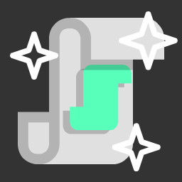

# Useful Scripts

<p align="center">
  
</p>

## About

**Useful Scripts** its plugin with some maybe useful scripts.

They includes[^1]:
- [ ] [GUI Creator](https://github.com/NickSteinGames/useful-scripts/wiki/GUICreator)
- [ ] FastRegEx
- [x] Guide Creator

***
Special thanks to [**@pikuler**](https://github.com/pikuler) for help with icons :3

## Installation
### From Assets Lib
  Just open `AssetLib` and print in search:
  ```
  Useful Scripts
  ```
### From wtere
Open [`Releases`](https://github.com/NickSteinGames/useful-scripts/releases) and download [Latest Release](https://github.com/NickSteinGames/useful-scripts/releases/latest).

## Road Map
- [ ] Add `Foldable Container` support _(after stable release Godot 4.5)_
- [ ] Add `GUICreator tool` (kinda `Guide Editor`)
- [ ] Adds other main [Control](https://docs.godotengine.org/en/latest/classes/class_control.html) nodes

[^1]: If mark is checked its means you need to enable plugin `Useful Scripts` in `Project Settings`
